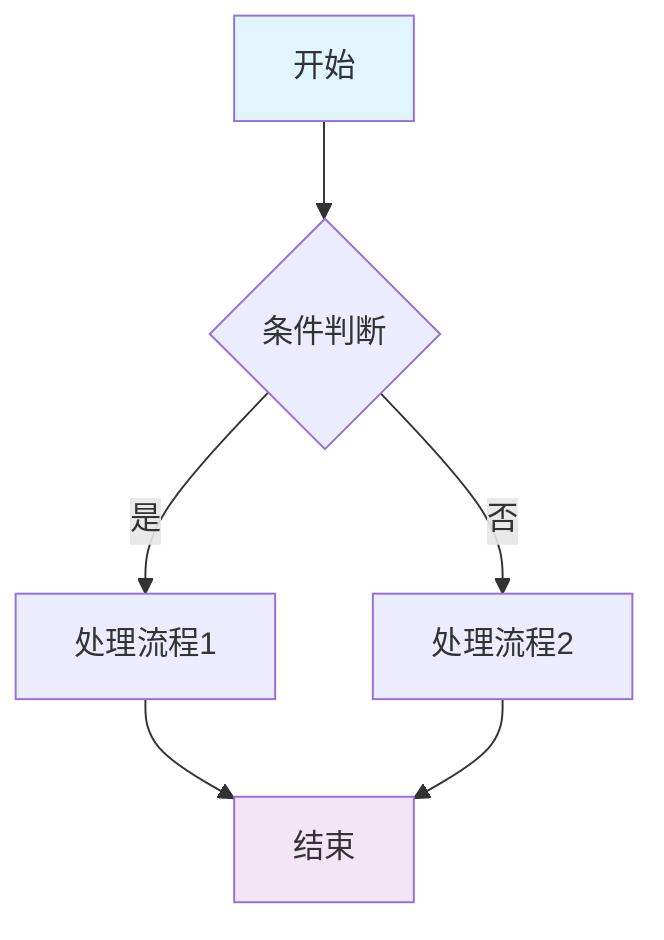

```mermaid
flowchart TD
    A[开始] --> B{条件判断}
    B -->|是| C[处理流程1]
    B -->|否| D[处理流程2]
    C --> E[结束]
    D --> E
    
    style A fill:#e1f5fe
    style E fill:#f3e5f5
```

这是一个简单的流程图示例：
- 从"开始"节点出发
- 经过条件判断分支
- 根据条件选择不同的处理流程
- 最终到达"结束"节点